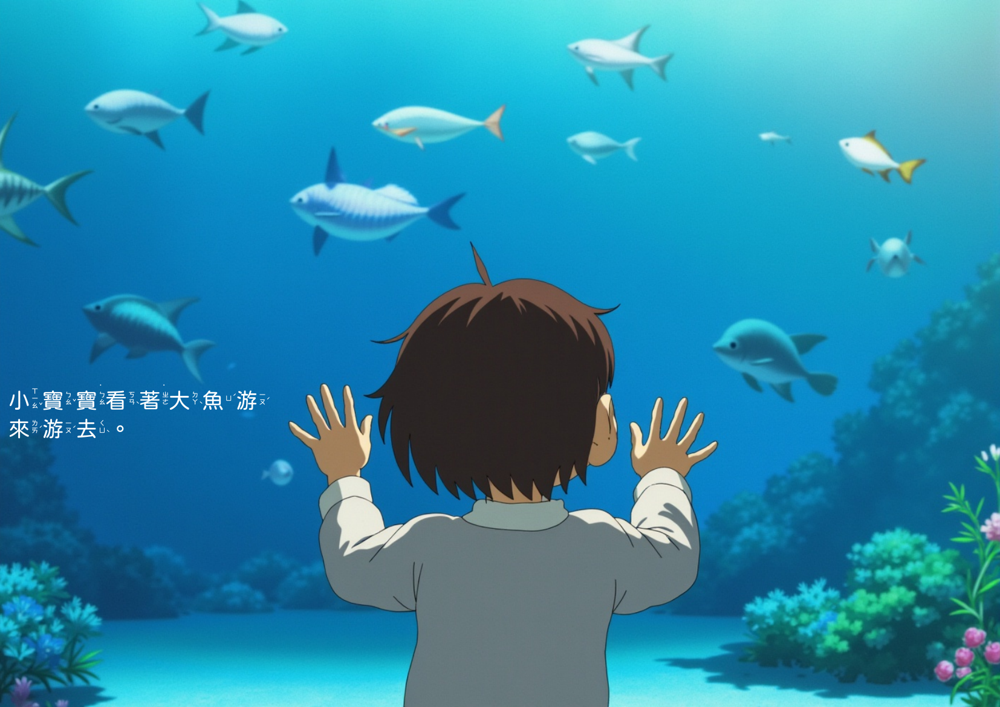
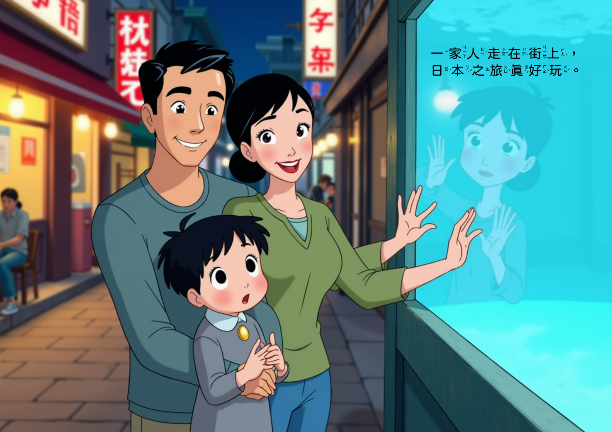
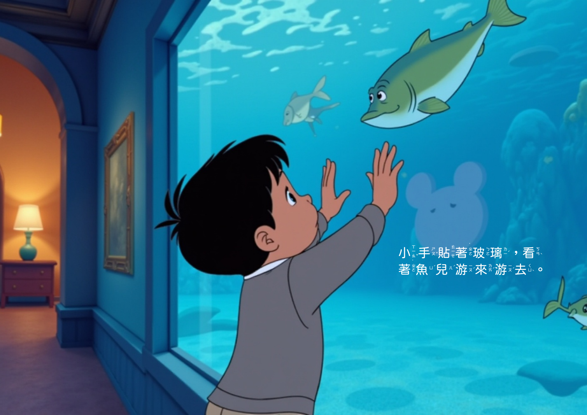
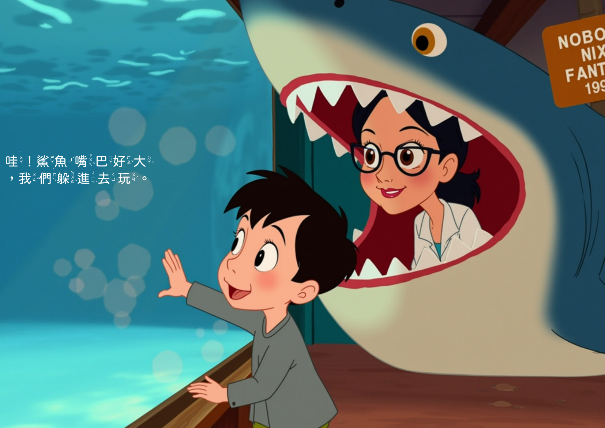
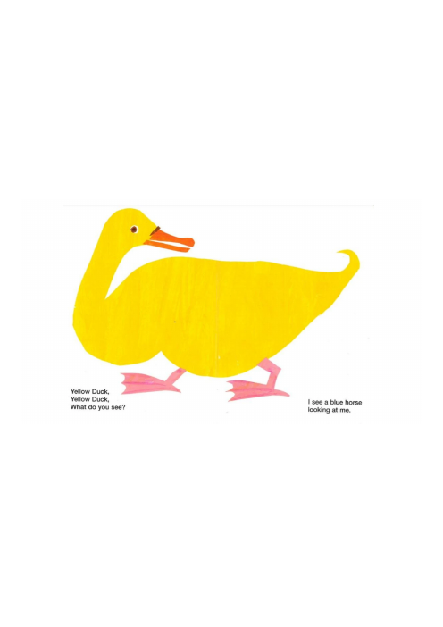
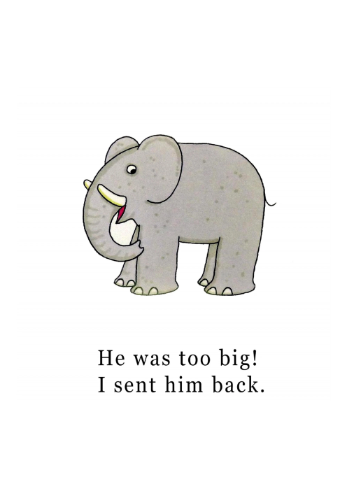
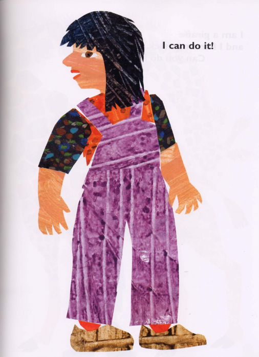
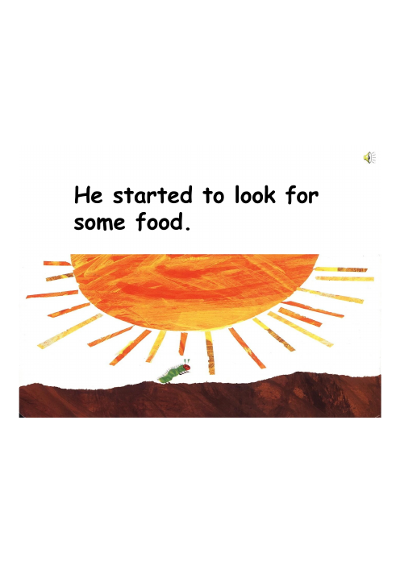

# Photo2Story 進度報告 — 2026/07/01 ~ 2026/07/29

> 承接 6/28 的 [storybook_improvements.md](storybook_improvements.md)（畫風收斂、閱讀分級、FLUX.1 全跨頁版面）。
> 本文件整理**這個月新增的五項優化**，並附上目前的實際輸出，與四本 0-2 歲、三本 3-6 歲的市售繪本做視覺對照。

---

## 0. 這個月做了什麼（一句話總覽）

上個月的重點是「文字內容變簡單、換成 FLUX.1、版面改全跨頁」；這個月的重點是**讓文字真的融入畫面，而不是蓋在畫面上**——包括自動偵測文字該放哪裡、確保連續跨頁角色不跑掉、注音排版對齊、以及文字本身的品質把關。

| # | 項目 | 對應模組 |
|---|---|---|
| 1 | 跨頁文字疊加位置偵測 | [`src/stages/text_placement.py`](../src/stages/text_placement.py) |
| 2 | 角色 / 場景跨頁連續性 | [`src/eval/narrative_continuity_judge.py`](../src/eval/narrative_continuity_judge.py)、[`src/eval/clip_score.py`](../src/eval/clip_score.py) |
| 3 | 注音（Zhuyin）排版校正 | [`src/utils/zhuyin.py`](../src/utils/zhuyin.py)、[`src/stages/zhuyin_render.py`](../src/stages/zhuyin_render.py) |
| 4 | 故事文字品質把關 | 故事生成 prompt / 解析邏輯 |
| 5 | 字型與畫風收斂 | 字型 fallback、`configs/demo.yaml` |

---

## 本月改動的研究價值

這個月的改動不只是「多做了幾個功能」，而是三個都留下書面紀錄（ADR）的方法論取捨——每一個都有明確的、可被檢視的理由，而不是事後合理化：

1. **用古典 CV 啟發式取代語義分割模型**（→ [ADR 0002](adr/0002-heuristic-badness-scoring-over-segmentation.md)）：文字安全區偵測只用 saliency + edge density + local variance（`cv2.saliency`、`cv2.Canny`、局部標準差），刻意不用 SAM2 / GroundingDINO 這類語義前景分割模型。犧牲了語義分割等級的精確度，換取零 GPU 依賴與低延遲——這是一個記錄在案的 scope 決策，`BadnessMap` 的三個通道也預留了未來加入前景遮罩通道的擴充空間。
2. **偵測式文字安全區取代固定文字框**（→ [ADR 0001](adr/0001-detected-text-overlay-replaces-fixed-zone.md)）：放棄了固定文字區「不管畫面內容、位置永遠安全」的保證，換取跟 `reference/3-6/` 真實繪本一樣、文字直接畫在插畫上視覺最安靜處的版面呈現。
3. **全管線固定單一字型，避免混淆變數**（→ [ADR 0003](adr/0003-fixed-font-across-pipeline.md)）：RQ1–3 消融實驗把照片選擇模式與敘事生成方式當作自變數，插畫風格與版面已經是控制變數；如果字型再隨畫風變化，就會在既有的控制變數上再疊加一層未受控的混淆變數。因此全管線固定使用同一套字型（jf-openhuninn），不隨頁面畫風調整。

這三項決策的共通點：**每一項都有考慮過的替代方案、明確的取捨理由、以及記錄在案的後果（consequences）**，而不是「先做了再說」。同樣的態度也用在自我檢查上——本報告的「已知限制」不是免責聲明，而是這個月評估方法論的一部分：例如角色一致性目前只能維持髮型/臉型/服裝層級、膚色仍會跨頁漂移，這個具體的失敗模式已經被精確定位並列為下月的優先項目，而不是被含糊帶過。

---

## 1. 跨頁文字疊加位置偵測

### 問題
上個月雖然換成了全跨頁版面（FLUX.1 + full-bleed），但文字仍然是**貼在固定區域**（例如畫面左下角）。真正的繪本文字是放在畫面裡「視覺上比較空、比較安靜」的地方——貼紙式的固定文字框常常剛好蓋住人臉或畫面重點。

### 做法
新增 [`text_placement.py`](../src/stages/text_placement.py)：
- 用 saliency（顯著性）、邊緣密度、色彩變異量算出一張「badness map」（原本命名 suitability map，後來重新命名為 badness map，語意更準確：分數越低代表越適合放字）
- 用 integral image 做跨頁矩形搜尋，找出畫面中最安靜的候選區塊（`pick_best` 依 badness 分數排序候選矩形）
- 排除跨頁裝訂溝(gutter)區域，避免文字被裝訂線切斷
- 偵測到候選區塊仍蓋住畫面熱點時，自動加一層半透明 scrim（暗化墊底），確保文字可讀性
- 無文字的頁面（wordless pages）直接跳過疊加渲染

### 結果對照

**你的輸出（吉卜力風，zh-tw，`demo_ghibli_20260727_151026`）：** 文字自動避開了主角剪影和魚群密集區，落在左下角相對安靜的水域上：

**你的輸出（迪士尼風，`demo_disney_20260728_093414`，第 4 頁）：** 這一頁畫面主體（一家三口）都在左側，偵測器把文字放到右側水族箱玻璃倒影的空白處，完全沒有蓋到任何一張臉：

**你的輸出（Pixar 風，`demo_pixar_20260728_100054`，第 2 頁）：** 這一頁畫面右半邊是鯊魚張嘴的重點區域，偵測器把文字放到左下角相對平靜的暗處，避開了整個鯊魚嘴與人臉：

**參考繪本（3-6 歲，《我學會等待》）：** 市售繪本也是把文字塊放在天空 / 草地等平坦色塊上，同樣避開角色主體：

> 觀察：這幾張的「文字選址邏輯」已經相當接近——都是找畫面裡色彩平坦、視覺安靜的區域。與參考繪本的差距主要在字級與行距的精緻度，而不是位置本身。

---

## 2. 角色 / 場景跨頁連續性

### 問題
繪本最重要的體驗是「同一個主角貫穿全書」。純粹逐頁獨立生成插圖時，主角的髮型、衣著、畫風細節容易跨頁跑掉，讀者會出戲。

### 做法
- `run_stage1` 的敘事生成加入**跨頁連續性 taxonomy**，指令中明確要求延續角色的外觀/衣著/場景線索
- 生成 prompt 注入 cross-spread character continuity 提示（把前一頁的角色描述帶入下一頁的 prompt）
- 新增 [`narrative_continuity_judge`](../src/eval/narrative_continuity_judge.py)：對跨頁評分角色是否一致
- 新增 [`clip_score`](../src/eval/clip_score.py)：評估單一跨頁內「文字敘述」與「畫面內容」的相關性
- FLUX 輸出改為橫幅跨頁比例（landscape spread ratio），搭配 `build_spread_pdf` 產生真正雙頁對開的 PDF

### 結果對照
**你的輸出（迪士尼風，`demo_disney_20260728_093414`，第 1、2 頁並排）：** 同一位小男孩從第 1 頁「獨自貼著玻璃看魚」延續到第 2 頁「在鯊魚嘴巴裡玩」，髮型、臉型、衣著維持一致——**但仔細比對兩頁的手部與臉部膚色，其實明顯不同**（第 1 頁偏深、偏橄欖色調；第 2 頁明顯偏白偏粉）：

**參考繪本（3-6 歲，《正能量企鵝繪本》）：** 主角企鵝與同伴長尾山雀在跨頁之間的體型、配色完全一致，是連續性的標竿：

> 觀察：目前靠 prompt 引導 + judge 評分的方式只能維持「輪廓級」的同一人（髮型、臉型、服裝），**顏色層級（尤其膚色）仍會跨頁漂移**，這點與參考繪本的固定角色模板還有明顯差距——那些繪本每頁都是同一份手繪模板上色，不會有色偏問題。這是下一步優先要收斂的項目，見「已知限制」。

---

## 3. 注音（Zhuyin）排版校正

### 問題
zh-tw 繪本需要在每個國字旁加注音（Bopomofo），本月初版排版有三個小瑕疵：輕聲調號位置偏移、聲調符號固定貼在字的頂端（字形高度不同時位置不齊）、以及兩個常見破音字誤讀。

### 做法
- [`zhuyin.py`](../src/utils/zhuyin.py) 修正「和」在台灣國語中的連接詞讀音、修正兩個常見的 pypinyin 破音字錯誤
- 聲調符號改為錨定在**最後一個字母**而非固定高度（`anchor tone marks to last letter, not fixed height`）
- 注音堆疊改為以國字的垂直中心點對齊（`center zhuyin stack on character vertical middle`）
- 輕聲調號從「文字旁邊」移到「文字堆疊上方」（`position neutral tone mark above the stack`）
- 字型渲染失敗時 fallback 到內建 CJK 字型，避免注音渲染整段消失

### 結果對照
第 1 節「吉卜力 page1」的文字在全頁縮圖中偏小，這裡直接放大該頁的文字區域，可以更清楚看到修正後的注音排版效果：每個字正上方的注音堆疊置中對齊、輕聲字（如「著」，注音只標「˙ㄓㄜ」不加聲調符號）的調號位置也已修正：

這部分**市售繪本(陶樂蒂的開學日)也普遍加注音**，可作為排版精細度的參照：

---

## 4. 故事文字品質把關

### 問題
故事生成偶爾會出現兩類問題：(a) 句子在語法上不完整（例如缺少主詞或斷句奇怪）；(b) VLM 幻覺出畫面中其實不存在的招牌文字內容，導致故事文字與畫面對不上。

### 做法
- 故事生成 prompt 加入語法完整性要求（`enforce grammatical completeness in story generation`）
- 加入文字品質提示，明確要求不要憑空杜撰畫面中看不清楚的招牌 / 標誌文字（`add text quality hint to prevent hallucinated signage`，7/29 最新一筆）

### 結果對照
本月尚未針對這兩項修正跑新的 demo（見下方「已知限制」），下次報告會補上修正後的實際輸出對照。

---

## 5. 字型與畫風收斂（延續 6/28 的基礎）

- 修正原本會整段消失的字型 fallback 問題，改為使用專案內建字型（`replace broken font fallback with bundled typefaces`）
- 沿用 6/28 收斂後的四種畫風（ghibli / pixar / disney / crayon），本月的三份範例輸出分別是三種畫風的實際成果

---

## 與市售繪本的整體差距總結

| 面向 | 目前狀態 | 市售繪本（3-6 歲組） | 市售繪本（0-2 歲組） |
|---|---|---|---|
| 文字位置 | 演算法自動偵測安靜區域，效果接近 | 手動排版，避開角色與重點 | 固定放在大面積留白處 |
| 角色一致性 | Prompt + judge 評分維持大致一致 | 手繪固定角色模板，逐頁完全一致 | 同左 |
| 文字量 / 用字難度 | 每頁 1 句、簡單詞（6/28 導入的 reading level） | 每頁 1-3 句 | 每頁 1 句重複句型（如《棕熊棕熊你看見什麼》） |
| 注音 | 已支援，位置已校正 | 部分書籍有注音 | 不適用（英文書籍） |
| 畫面留白 / 呼吸感 | 全跨頁滿版插畫，文字靠 scrim 疊加 | 保留天空/草地等大面積留白 | 大量留白，主體極簡（剪貼畫風） |

《0-2 歲組》的四本參考書（Brown Bear、Dear Zoo、The Very Hungry Caterpillar、From Head to Toe）具代表性的一頁如下，可以看出這個年齡層的繪本幾乎不需要處理「文字疊在複雜畫面上」的問題——因為畫面本身就是留白為主：

這也點出一個可以跟教授討論的方向：**Photo2Story 目前鎖定的是 3-6 歲的「滿版敘事插畫」路線，而不是 0-2 歲的「極簡留白」路線**——兩者對「文字疊加」演算法的需求完全不同，0-2 歲繪本反而不太需要這個月做的 saliency-based 文字選址技術。

---

## 已知限制 / 下一步

1. 第 4 節的兩筆修正進度不同：文法完整性修正（`a1cc5ee`，7/27 15:56 提交）**已經反映**在 Pixar / 迪士尼這兩份 7/28 的範例輸出中（demo 產出時間晚於這筆 commit）；但防幻覺標誌文字修正（`f749eb0`，7/29 提交）**還沒有對應的新 demo**，三份範例都早於這筆修正。下次報告前應針對防幻覺這項重新跑一次 pipeline 驗證。
2. **TODO** 角色一致性目前仍是「大致像」而非「像素級模板複用」：本月範例中（迪士尼風 `demo_disney_20260728_093414` 第 1、2 頁）同一男孩的髮型/臉型/衣著維持一致，**但膚色跨頁明顯漂移**（第 1 頁偏深橄欖色、第 2 頁偏白偏粉），與參考繪本的固定角色模板仍有明顯差距。下個月優先項目：讓 continuity prompt 或 judge 把膚色/髮色也納入一致性檢查範圍，而不只是姿勢與構圖。
3. 0-2 歲組的比較主要是說明「兩種繪本留白哲學不同」，如果教授的重點是 3-6 歲敘事類型，可以在下次報告中拿掉 0-2 組、把篇幅留給更多 3-6 歲對照頁。
