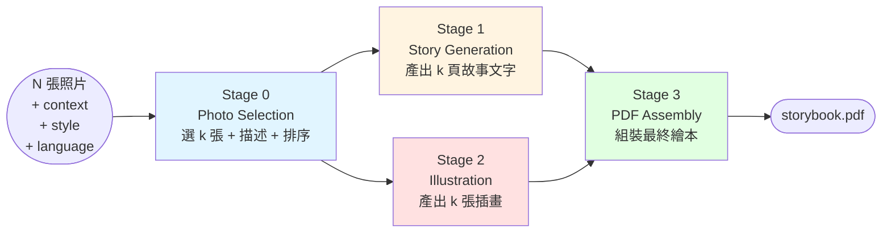
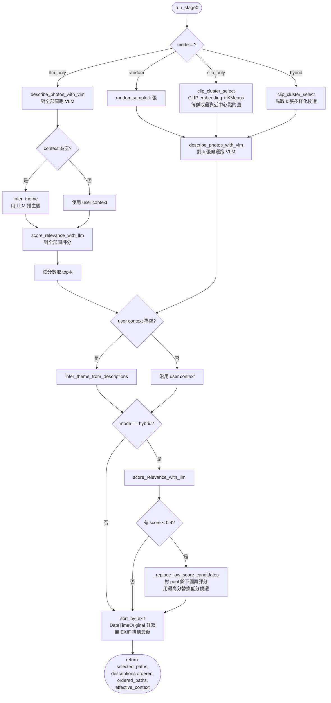
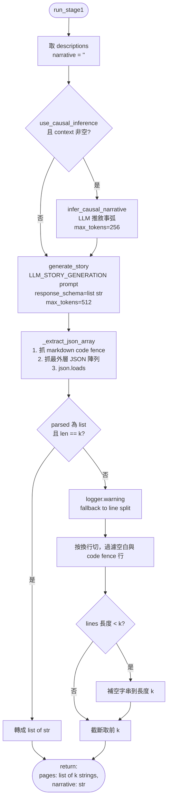
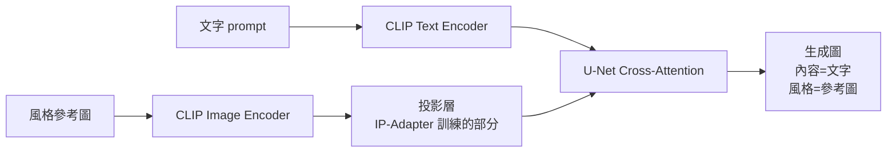
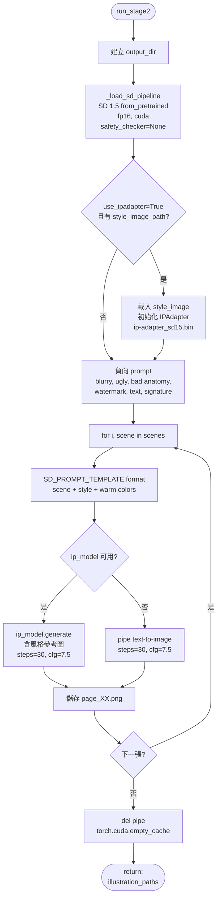
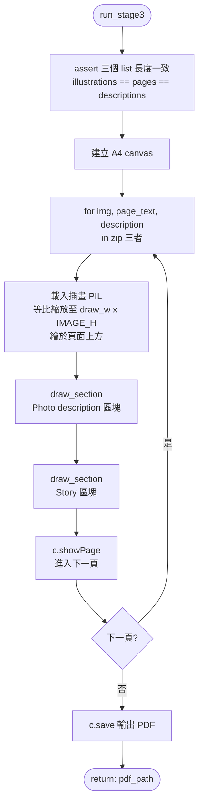
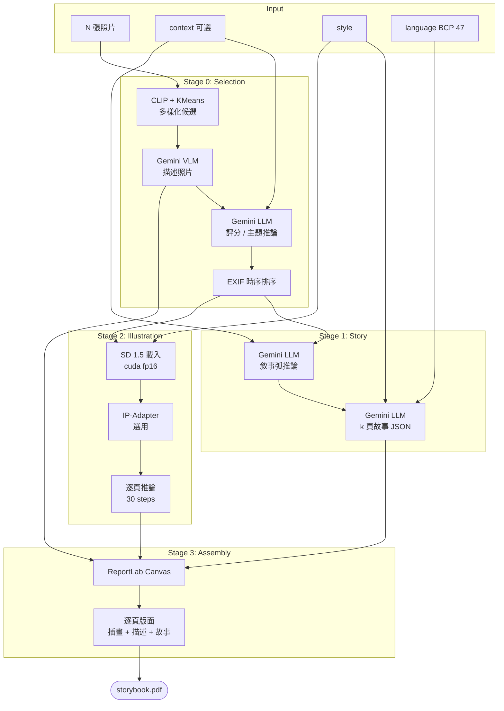

# Photo2Story Pipeline 技術報告

**日期**：2026-05-19
**對應 commit**：`6a736ae` (feat(cli): produce per-run artifact bundle for ablation runs)

> 將一組旅遊照片轉換成兒童繪本（含插畫 + 故事文字 + PDF）的四階段 pipeline。

---

## 1. 系統總覽

Photo2Story 將 N 張使用者上傳的照片，搭配選填的「主題 context」與「畫風 style」，產出一本 K 頁的兒童繪本 PDF。整體分為四個獨立但相依的階段：

### 1.1 各階段的輸入 / 輸出契約

| Stage | 輸入 | 輸出 | 技術棧 | 執行位置 |
| --- | --- | --- | --- | --- |
| **0. Selection** | N 張照片 + context | k 張 ordered_paths + descriptions | CLIP, KMeans, Gemini VLM/LLM, piexif | 本地 + Vertex AI |
| **1. Story** | descriptions, context, style, language | k 頁故事文字 + narrative | Gemini LLM (structured output) | Vertex AI |
| **2. Illustration** | descriptions, style | k 張 PNG | Stable Diffusion 1.5 + IP-Adapter | 本地 CUDA GPU |
| **3. Assembly** | 插畫 + 故事 + 描述 | PDF 檔 | ReportLab, PIL | 本地 CPU |

### 1.2 ✅ 目前 demo 使用的模型配置

> 來源：[`configs/demo.yaml`](../configs/demo.yaml)
> 執行指令：`python run_experiment.py --config configs/demo.yaml --photos 'data/apple_swim/*.JPG' --output output`

| Stage | 參數 | 目前 demo 值 | 備註 |
| --- | --- | --- | --- |
| **Stage 0** | `mode` | `hybrid` | CLIP 多樣化 + LLM relevance 替換 |
| | `k` | `4` | 選 4 張照片成書 |
| | `clip_model` | `ViT-B-32` | OpenCLIP 視覺編碼 |
| | `clip_pretrained` | `openai` | OpenAI 原始預訓練權重 |
| | `vlm_model` | `gemini-2.5-flash` | 描述照片用 |
| | `llm_model` | `gemini-2.5-flash` | 評分 / 推主題用 |
| **Stage 1** | `model` | `gemini-2.5-flash` | 故事生成（兩步式） |
| | `context_mode` | `full` | 將完整 context 餵給 LLM |
| | `use_causal_inference` | `true` | 啟用 narrative arc 兩步生成 |
| **Stage 2** | `base_model` | `runwayml/stable-diffusion-v1-5` | 文字到圖片 |
| | `use_ipadapter` | `true` | 啟用風格鎖定 |
| | `use_stylealigned` | `false` | 暫未使用 StyleAligned |
| | `style_image_path` | `null` | demo 未指定風格參考圖（IP-Adapter 走預設） |
| **Stage 3** | `output_format` | `pdf` | A4 繪本 |
| | `page_layout` | `image_top_text_bottom` | 上插畫、下文字 |

**整體上**：demo 配置 = **「完整功能版本」**（hybrid 選圖 + causal inference + IP-Adapter 全開），用來展示 pipeline 端到端的最高品質輸出。Ablation 實驗會逐一關掉某項以量測貢獻。

---

## 2. Stage 0 — Photo Selection（照片選取與描述）

### 2.1 目標

從使用者提供的 N 張照片中挑出最具代表性、彼此差異夠大、且與主題相關的 **k 張**照片，並產出每張的英文描述供下游使用，最後依拍攝時間排序。

### 2.2 技術組成

| 技術 | 用途 |
| --- | --- |
| **OpenCLIP (ViT)** | 將照片編碼成 visual embedding（語意空間） |
| **K-Means clustering** | 在 embedding 空間做群聚，每群取一張代表照 → 保證多樣性 |
| **Gemini VLM** | 對每張照片生成英文描述（"who, what, where, mood"） |
| **Gemini LLM** | (1) 對描述與 context 的相關性評分 (2) 在缺 context 時推論主題 |
| **piexif** | 讀取 EXIF `DateTimeOriginal` 做時序排序 |

### 2.3 四種運作模式（Ablation 用）

| Mode | Phase A 候選來源 | Phase B 是否評分 | Phase B 是否替換 |
| --- | --- | --- | --- |
| `random` | 隨機 k 張 | 否 | 否 |
| `clip_only` | CLIP + KMeans 群心代表 | 否 | 否 |
| `llm_only` | 對全部圖打分後取 top-k | 已內含 | 否 |
| `hybrid` | CLIP + KMeans 取 k 張 | 是（對 k 張） | 是（score < 0.4 → 從 pool 換） |

### 2.4 邏輯流程

### 2.5 設計考量

- **多樣性 vs 相關性的權衡**：`hybrid` 模式先用 CLIP 保證**視覺多樣性**（避免 k 張長得太像），再用 LLM relevance 過濾與主題不相關的 outlier。兩階段設計避免單一指標的缺陷。
- **`effective_context` fallback**：當使用者未提供 context 時，用 VLM 描述讓 LLM 推一個主題短語。確保下游 Stage 1 永遠有非空主題可用。
- **低分替換的延遲計算**：`_replace_low_score_candidates` 只在偵測到 score < 0.4 時才對剩餘圖跑 VLM/LLM，節省 API 呼叫成本。
- **EXIF 排序兜底**：解析失敗的圖不會 crash，會被擺到序列最後。

---

## 3. Stage 1 — Story Generation（故事文字生成）

### 3.1 目標

依照 k 張照片的英文描述、主題、風格、語言，產出 **k 頁的故事文字**（每頁 2-3 句），且頁與頁之間具備敘事連貫性。

### 3.2 技術組成

| 技術 | 用途 |
| --- | --- |
| **Gemini LLM (Vertex AI)** | 兩階段文字生成 |
| **Structured output (`response_schema=list[str]`)** | 強制 LLM 回 JSON 陣列 |
| **三層解析防禦** | regex 抓 code fence → 抓 `[...]` 切片 → fallback 按行切 |

### 3.3 兩步式生成

1. **Causal Inference（選用）** — 用 `LLM_CAUSAL_INFERENCE` prompt 讓 LLM 看完所有描述後寫一段 2-3 句的敘事弧線（描述「起因 → 轉折 → 結束」與場景間的因果關係），當作劇情骨架。
2. **Story Generation** — 用 `LLM_STORY_GENERATION` prompt，把 narrative + 每張照片描述塞入，要求 LLM 回**長度恰為 k 的 JSON 字串陣列**，每筆對應一頁文字。

### 3.4 邏輯流程

### 3.5 設計考量

- **為什麼分兩步？** 直接從照片描述生成故事，LLM 容易**逐頁獨立描述**而缺乏前後因果。先抽 narrative arc 等於 chain-of-thought，讓模型先思考故事結構，再寫頁文字 → 提升頁間連貫性。
- **`use_causal_inference` 作為 ablation 開關**：用於量測「兩步式因果推論」對故事品質的貢獻；可於實驗中 toggle 比較單步 vs 兩步輸出。
- **長度保證**：fallback 強制將輸出對齊到剛好 k 頁（不足補空字串，超過截斷）。這個保證對 Stage 3 至關重要——Stage 3 是「一張插畫對一頁文字」的 zip 組裝，長度錯位會整本書錯位。
- **多語支援**：透過 BCP 47 locale code（`en`, `zh-tw`, `zh-cn`, `ja`）控制故事輸出語言，但插畫 prompt 仍維持英文（見 Stage 2）。

---

## 4. Stage 2 — Illustration Generation（插畫生成）

### 4.1 目標

為每頁產出風格一致的兒童繪本插畫。輸入是該頁照片的**英文 VLM 描述**（非故事文字），輸出 k 張 PNG。

### 4.2 技術組成

| 技術 | 用途 |
| --- | --- |
| **Stable Diffusion 1.5**（HuggingFace `diffusers`） | 文字到圖片生成模型 |
| **IP-Adapter（選用）** | 注入風格參考圖，鎖定全書畫風一致 |
| **CUDA + fp16** | GPU 加速推論（每張約幾秒） |

### 4.3 IP-Adapter 的角色

IP-Adapter 是輕量級擴充模組（~22M 參數），讓 SD 除了吃文字 prompt 外**也能吃一張圖片**當 prompt。原理是新增一條平行的 cross-attention 接 image embedding（decoupled cross-attention）：

對「**繪本**」格式特別關鍵：人類最在意「整本書畫風一致」，純 text prompt 做不到此點。

### 4.4 邏輯流程

### 4.5 設計考量

- **為什麼用 VLM 描述當輸入，而非故事文字？** SD 1.5 的 CLIP text encoder 訓練語料是 LAION 英文 caption，**非英文 prompt 品質會顯著下降**。故事文字可能是中文/日文，但 VLM 描述本就是英文且為「視覺事實」（誰在哪裡做什麼），更適合 text-to-image。
- **IP-Adapter vs LoRA**：LoRA 需要訓練（30 分 – 數小時），IP-Adapter 預訓練好可直接用，做 ablation 實驗時只需換 `style_image_path` 即可換畫風。
- **`safety_checker = None`**：關掉 NSFW 過濾器，避免偶爾誤判（將抽象構圖標為 NSFW 而回傳全黑圖）造成空白頁。實驗用途下可接受，部署時須重評。
- **VRAM 釋放**：`del pipe; torch.cuda.empty_cache()` 主動釋放，避免後續任務 OOM。

---

## 5. Stage 3 — PDF Assembly（PDF 組裝）

### 5.1 目標

將 Stage 1 的 k 頁故事、Stage 2 的 k 張插畫、Stage 0 的 k 段描述，組裝成 A4 大小的 PDF 繪本。每頁版面：上方插畫，下方依序為照片描述與故事文字。

### 5.2 技術組成

| 技術 | 用途 |
| --- | --- |
| **ReportLab** | PDF 繪製（canvas API） |
| **PIL** | 載入 PNG 並計算等比例縮放 |

### 5.3 邏輯流程

### 5.4 設計考量

- **嚴格的長度檢查**：`assert len(illustrations) == len(pages) == len(descriptions)`，若 Stage 1/2 任一階段長度不對齊則直接 fail-fast，避免錯位的繪本悄悄產出。
- **`_wrap_text` 簡易斷行**：以字元數估算，對英文 OK；中日韓文字寬度與英文不同可能需要進一步處理（目前用 Helvetica 字體，中文不支援可能會掉字 → 未來可改 CJK 字體）。
- **欄位語意分離**：每頁同時顯示「Photo description」（VLM 視覺事實）與「Story」（LLM 生成的繪本文字），方便評估時對照 ground truth 與生成結果。

---

## 6. 整體技術選型總結

### 6.1 為什麼這樣分工？

| 任務性質 | 適合的模型類別 | 本專案選擇 |
| --- | --- | --- |
| 視覺語意編碼 / 多樣性 | CLIP-like | OpenCLIP |
| 多模態描述 / 評分 / 推論 | VLM + LLM | Gemini (Vertex AI) |
| 文字到圖片生成 | Diffusion | Stable Diffusion 1.5 |
| 風格一致性 | Adapter | IP-Adapter |
| 文件排版 | 模板引擎 | ReportLab |

### 6.2 雲端 vs 本地的混合架構

- **雲端（Vertex AI Gemini）**：負責所有**文字 / 語意推論**任務。優點是無需本地維護大模型、品質高、多語支援好。
- **本地 GPU（SD 1.5 + IP-Adapter）**：負責**圖像生成**。優點是 (1) 可用 IP-Adapter 等社群工具精細控制畫風（雲端 API 通常不支援），(2) 大量產圖（ablation 實驗）成本可控。

### 6.3 Ablation 開關一覽

本 pipeline 大量採用「配置驅動」設計，便於做控變實驗：

| 開關 | 位置 | 比較目標 |
| --- | --- | --- |
| `stage0.mode` | Stage 0 | random / clip_only / llm_only / hybrid 對最終品質的影響 |
| `stage1.use_causal_inference` | Stage 1 | 兩步式 vs 單步式故事生成 |
| `stage2.use_ipadapter` | Stage 2 | 有無風格參考圖的畫風一致性 |
| `stage0.k`, `stage0.clip_model` | Stage 0 | 不同 k 值與不同 CLIP backbone 的效果 |

### 6.4 端到端 Pipeline 圖

---

## 7. 已知限制（現況）

| 限制 | 影響 |
| --- | --- |
| SD 1.5 限制英文 prompt | 故事是中文/日文時，插畫仍須英文 prompt 中介 |
| ReportLab Helvetica 不支援中文 | 中文故事 PDF 可能掉字 |
| 本地 SD 需要 CUDA GPU | 無法純 CPU 部署 |
| 無故事品質的自動評估 | Ablation 需人工評分，難規模化 |
| Stage 2 不參考故事內容 | 插畫只反映照片描述，可能與故事文字略有落差 |

---

## 8. 下次報告預計改進方向

### 8.1 多語系支援強化

目前 Stage 1 已支援 BCP 47 locale code（`en` / `zh-tw` / `zh-cn` / `ja`），但端到端仍有缺口：

| 項目 | 現況 | 改進計畫 |
| --- | --- | --- |
| **故事文字多語產出** | Gemini 已支援，可正確輸出中/日文 | 加入更多語言（`ko`, `es`, `fr`）並對比品質 |
| **PDF 字體** | Helvetica → 中文掉字 | 嵌入 Noto Sans CJK / 思源黑體，依 `language` 自動切字體 |
| **插畫 prompt 翻譯** | 一律走英文（VLM 描述） | 測試是否需要將故事文字「翻譯回英文」融入 SD prompt，使插畫更貼故事而非僅貼照片 |
| **文化適配** | 風格詞如 "watercolor" 無在地差異 | 評估「日式繪本 / 中式水墨」等文化專屬風格是否需要客製 prompt |
| **多語故事連貫性評估** | 未量化 | 引入 BLEU / BERTScore 或 LLM-as-judge 在各語言下比較 |

### 8.2 不同畫風的系統性測試

目前 `style` 參數是自由字串，僅做了少數測試。下次報告預計擴大為**風格矩陣實驗**：

| 風格類別 | 預計測試風格 | 評估指標 |
| --- | --- | --- |
| **西式繪本** | watercolor, crayon, gouache, pencil sketch | 風格一致性、兒童友善度 |
| **動漫風格** | anime, Studio Ghibli, chibi | 角色穩定性、可愛感 |
| **東方風格** | Chinese ink wash, ukiyo-e, traditional Japanese | 文化適配度 |
| **數位風格** | pixel art, flat design, 3D render | 現代感、識別性 |
| **古典藝術** | impressionist, Van Gogh, Monet | 美感、藝術性 |

對每個風格進行以下對照：

- **無 IP-Adapter vs 有 IP-Adapter（給對應風格參考圖）** → 量測畫風一致性
- **跨頁畫風漂移程度** → 用 CLIP image similarity 計算 page-to-page distance
- **與目標風格的吻合度** → 用 CLIP text-image similarity 對比 prompt 與輸出

### 8.3 自動化評估框架

目前 ablation 仍靠人工觀察，下次預計加入：

| 評估面向 | 方法 |
| --- | --- |
| **故事品質** | LLM-as-judge（Gemini Pro 評分 coherence / creativity / age-appropriateness） |
| **插畫-故事對齊度** | CLIPScore：每頁文字 vs 對應插畫的相似度 |
| **畫風一致性** | 同本書 k 張插畫兩兩 CLIP image embedding 距離 |
| **照片利用率** | 選中的 k 張在最終故事中被「具體呼應」的比例 |
| **多樣性** | LPIPS 量測 k 張選圖之間的視覺差異 |

### 8.4 模型升級的取捨研究

下次報告希望比較：

| 比較項目 | A | B | 目的 |
| --- | --- | --- | --- |
| Image model | SD 1.5 | SDXL / Imagen 3 | 多語 prompt 品質、生成速度 |
| LLM | Gemini 2.5 Flash | Gemini 2.5 Pro / GPT-4o | 故事品質 vs 成本 |
| VLM 描述粒度 | 2-3 句 | 5-6 句、含情緒 | 描述詳細度是否提升故事品質 |
| 插畫條件 | 僅 VLM 描述 | 加入原始照片做 img2img | 是否更貼合實際場景 |

### 8.5 使用者研究

從技術評估擴展到使用者面向：

- **A/B 測試**：給家長/兒童看不同模式（random / hybrid）的成品，量化偏好
- **可讀性測試**：故事文字的字彙難度（Flesch-Kincaid for English；中文用句長/常用字比例）
- **參與感**：是否能從故事中認出自己的照片場景

### 8.6 工程面的改進

| 項目 | 現況 | 改進 |
| --- | --- | --- |
| 端到端時間 | 未量化 | 加入每階段 timing log，找出 bottleneck |
| 失敗處理 | 部分 fallback（Stage 1 JSON 解析） | 補上 Stage 0 VLM/LLM 失敗的 retry / fallback |
| Pipeline 平行化 | 全序列執行 | Stage 1（雲端）與 Stage 2（本地）可並行 → 縮短總時間 |
| 配置管理 | YAML 配置 | 加入 config 驗證與預設 sweep template |

---

*報告日期：2026-05-19*
